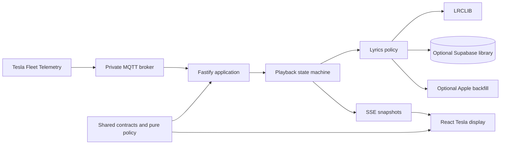

# Architecture and dependency boundaries

Awesome Lyrla is a single-owner Tesla companion application, but it still has several independent
trust and failure domains.



## Source layers

- `src/shared`: transport contracts and dependency-free policy used by both runtimes.
- `src/server`: credentials, external providers, persistence, telemetry and playback orchestration.
- `src/client`: browser rendering, setup UX and snapshot consumption.
- `supabase`: append-only schema history and database contract tests.
- `scripts`: local maintenance and guarded release entrypoints.

The dependency rules are executable in `dependency-cruiser.config.cjs`:

```text
client ───────▶ shared ◀─────── server
  │                              │
  └────── no server import ──────┘
```

`shared` cannot import either runtime, client code cannot import server code, server code cannot
import client code and production code cannot import tests. Circular dependencies are rejected.

## Trust boundaries

The browser is untrusted. It may receive display state and opaque candidate tokens, but Tesla
tokens, Supabase secret keys, private keys, administrator session values and raw provider
credentials remain server-side.

The database and remote lyric providers are also fallible inputs. Their responses do not become
display state until the matching, timing and generation policies accept them.

## Change protocol

Before changing a boundary or cross-layer contract:

1. Identify the affected invariant in `docs/invariants`.
2. Add evidence at the lowest useful layer: pure policy, adapter contract, database SQL or end-to-end.
3. Describe compatibility and rollout behavior in the pull request.
4. Add an ADR when the change introduces a new dependency direction or trust boundary.
